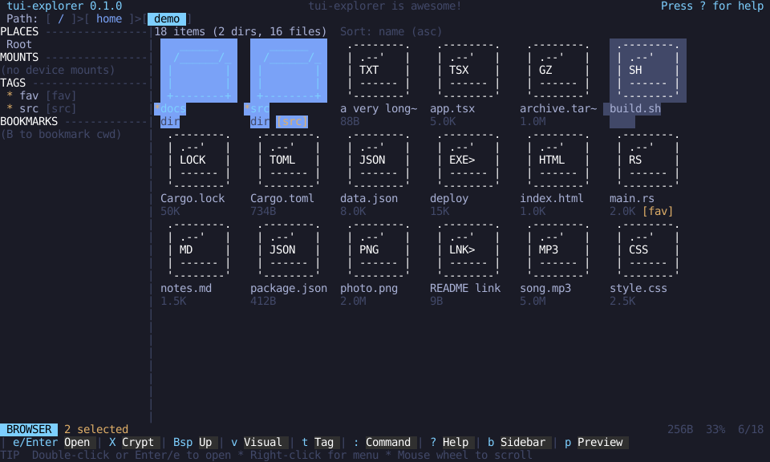
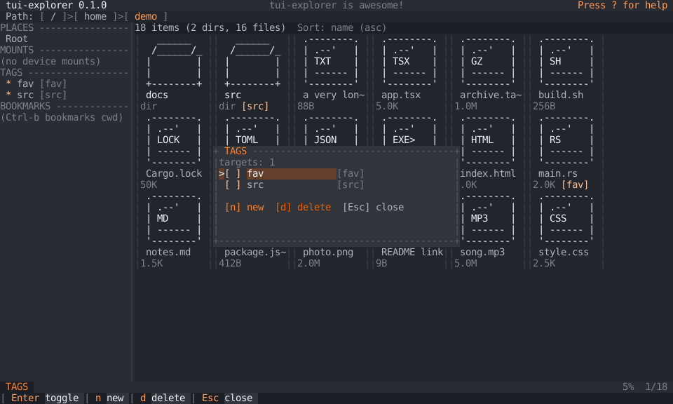
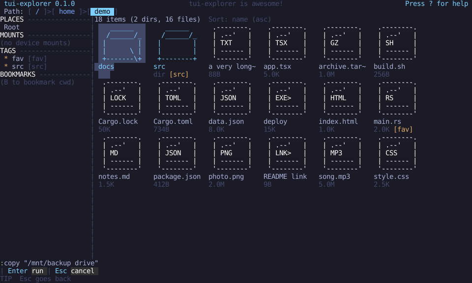

# tui-explorer

A fast, open-source terminal file explorer for Linux with mouse support for GUI-like navigation and full Vim-style keyboard controls. Browse, open, select, move, rename, copy, delete, tag, and manage files without leaving the terminal.



## What it is

tui-explorer turns your terminal into a file manager that feels like a small desktop application. You can drive it entirely with the keyboard using Vim-style motions, or point and click with the mouse: click to select, double-click to open, right-click for a context menu, scroll with the wheel, and click the breadcrumb to jump to any parent directory. All icons are plain ASCII art drawn by the application's own icon engine, so it works in any terminal without Nerd Fonts, emoji support, or desktop icon themes.

Named tags (such as `[src]` or `[fav]`) can be attached to any file or directory and are stored in a local SQLite database, so they survive restarts.

## Features

- Directory browsing with breadcrumb, metadata columns, and symlink, executable, hidden, socket, pipe, and device distinctions
- Full Vim-style keyboard control plus complete mouse navigation; no operation requires a mouse
- Multi-selection with visual mode
- Colon commands for copy, move, rename, delete, tag, and navigation
- Original ASCII icon engine with compact, small, and large icon variants
- Persistent named tags backed by SQLite, with a tag picker for creating, assigning, and deleting tags
- Safe deletions: explicit confirmation, a second confirmation for recursive directory deletes, and conflict choices (cancel, skip, replace) for copy and move
- Background workers for long operations, with live progress in the status bar
- Responsive layout that adapts from ultrawide down to tiny terminals
- Correct handling of non-UTF-8 Linux filenames
- Deterministic, automatically generated screenshots and snapshot tests



## Controls

| Key | Action |
| --- | --- |
| `j` / Down | move selection down |
| `k` / Up | move selection up |
| `h` / Left | open parent directory |
| `l` / Right / Enter | enter directory or open file |
| `g g` | first entry |
| `G` | last entry |
| `Ctrl-u` / `Ctrl-d` | half page up / down |
| PageUp / PageDown | full page up / down |
| Space | toggle entry in selection |
| `v` | enter or leave visual multi-selection mode |
| `.` | toggle hidden files |
| `t` | toggle the default or last-used tag |
| `T` | open the tag picker and manager |
| `:` | enter command mode |
| Esc | cancel the current mode, modal, or command |
| `?` | open the help overlay |
| `q` | quit (when no modal or command is active) |

Mouse controls:

- Left click: select a row, activate a legend action, or navigate the breadcrumb
- Double left click: enter a directory or open a file
- Right click: context menu for the focused entry
- Mouse wheel: scroll the list
- Click a tag badge in the details panel: open the tag picker
- Click outside a modal: dismiss it (only when safe, destructive confirmations always cancel)



## Command mode

Press `:` and type a command. Paths with spaces work when quoted, for example `:copy "/mnt/backup drive"`. Commands apply to all selected entries, or to the focused entry when nothing is selected.

| Command | Action |
| --- | --- |
| `:copy <destination>` | copy targets to a directory |
| `:move <destination>` | move targets to a directory |
| `:rename <new-name>` | rename the focused entry |
| `:delete` | delete targets (always confirmed) |
| `:tag <name>` | assign a tag (created if missing) |
| `:untag <name>` | remove a tag |
| `:tags` | open the tag picker |
| `:open` | open the focused entry |
| `:cd <path>` | change directory (`~` and relative paths work) |
| `:quit` | quit |
| `:help` | open the help overlay |

Command input is parsed by the application itself. It is never passed to a shell, and files are always opened by spawning programs directly with argument arrays.

## Icons

Icons are built from ordinary ASCII characters by a first-party icon engine. No patched font is required. Each file category has a one-cell compact icon for narrow terminals, a small icon for lists, and larger ASCII art for the details panel.

| Icon | Category |
| --- | --- |
| `dir` | folder |
| `opn` | focused folder |
| `.dr` | hidden folder |
| `lnk` | symlink |
| `exe` | executable or binary |
| `rs` `ts` `js` `c` `c++` `py` `sh` | source files by language |
| `htm` `css` `jsn` `tml` `yml` `md` | web, data, and text formats |
| `img` `aud` `vid` | media files |
| `zip` `pdf` `db` | archives, documents, databases |
| `git` `cgo` `clk` `pkg` `lck` `mk` `dkr` `cfg` | git, Cargo, Node, make, container, and config files |
| `?` | unknown |

Resolution is deterministic: special filesystem type, special directory name, exact filename, compound extension, standard extension, executable status, then a generic fallback.

## Tags

Tags are named labels stored in a many-to-many SQLite database:

```
$XDG_DATA_HOME/tui-explorer/tags.sqlite3
```

If `XDG_DATA_HOME` is unset or invalid, the fallback is `$HOME/.local/share/tui-explorer/tags.sqlite3`. Mutable data is never written to `/usr`.

- `t` toggles the last-used tag on the selection
- `T` opens the picker: `n` creates a tag, Enter assigns or unassigns, `d` deletes a tag definition
- List rows show compact badges like `[fav]`; the details panel shows the full list
- Badges are text, so tags stay identifiable without color
- Unix paths are stored as raw bytes, so non-UTF-8 names round-trip exactly
- When you rename or move an entry inside tui-explorer, its tags follow automatically
- Moves done outside the application (for example with `mv`) cannot always be followed; the old path keeps its tags until you re-tag the new one


## Installation

Build from source with Cargo. You need a Rust toolchain (1.85 or newer) and a C compiler for the bundled SQLite build.

Gentoo:

```
sudo emerge --ask dev-lang/rust dev-vcs/git
```

Arch Linux:

```
sudo pacman -S rust git
```

Debian or Ubuntu:

```
sudo apt install cargo rustc git build-essential
```

Any other distribution: install the equivalent Rust toolchain, Git, and a C compiler using its package manager.

Then:

```
git clone https://github.com/0bifthenelse/tui-explorer.git
cd tui-explorer
cargo build --release
./target/release/tui-explorer
```

Optional: install the binary into your user path, for example `cargo install --path .` which places it under `~/.cargo/bin`.

## Running from source

```
cargo run --release
cargo run --release -- /some/start/directory
tui-explorer --help
tui-explorer --version
```

## Configuration and data locations

- Tags database: `$XDG_DATA_HOME/tui-explorer/tags.sqlite3`
- Configuration (reserved for future options): `$XDG_CONFIG_HOME/tui-explorer/config.toml`
- Disposable cache and logs: `$XDG_CACHE_HOME/tui-explorer/`

Opening files:

- If `$EDITOR` is set, regular files open in it; the interface suspends cleanly and restores the terminal afterwards
- `TUI_EXPLORER_OPENER` overrides `$EDITOR` when you want a different program
- Without either, files open through `xdg-open`
- Directories always open internally

## Safety and deletion behavior

Deletion is permanent. `:delete` always opens a confirmation modal that names the target, and deleting directories requires a second, deliberate confirmation for the recursive step. Copy and move never overwrite silently: existing destinations open a conflict modal with cancel, skip, and replace choices. Copying or moving a directory into itself is rejected, as is any operation where source and destination are the same path. When a multi-entry operation partially fails, the status bar reports exactly how many entries completed, were skipped, and failed.

The terminal is protected by a lifecycle guard: raw mode, mouse capture, and the alternate screen are restored on exit, on error, and on panic.

## Non-UTF-8 paths

Linux filenames are bytes, not text. tui-explorer keeps paths as `PathBuf` and names as `OsString` internally and only converts to a display string (with the standard `�` replacement marker) at render time. Tag records store the raw bytes, so tagging works on any filename. Displayed text is never used as a filesystem identifier.

## Architecture

Single Cargo package with a library and two binaries (`tui-explorer` and the `screenshots` generator):

- `app`: application state, modes, the reducer, and side-effect boundaries
- `ui`: layout tiers, rendering, and the hit-test model used by the mouse
- `input`: key mapping, click detection, and the command parser
- `browser`: directory state, sorting, filtering, selection, navigation
- `filesystem`: the `FileSystem` and `MutationBackend` traits plus the real Linux backend
- `operations`: copy, move, rename, delete jobs, validation, and conflict handling
- `icons`: the ASCII icon registry and resolver
- `tags`: the SQLite repository, schema, and migrations
- `config`: XDG path resolution
- `terminal`: lifecycle guard, panic hook, and suspend/resume for editors
- `testing`: in-memory filesystem, recording mutation service, deterministic builders, event replay, and the SVG converter

Domain state is independent of the terminal widgets, so behavior is tested without a terminal and without touching the real filesystem.

## Testing

```
cargo test --workspace
cargo clippy --workspace --all-targets --all-features -- -D warnings
cargo fmt --all --check
```

All automated tests run against a synthetic in-memory filesystem, a recording mutation service that performs no host I/O, and in-memory SQLite. No test creates, copies, renames, moves, or deletes a real file.

Visual snapshots live in `tests/snapshots/`. To review or update them deliberately:

```
UPDATE_SNAPSHOTS=1 cargo test --test visual
git diff tests/snapshots
```

To regenerate the README screenshots (they are built from synthetic data and rendered through the deterministic test backend):

```
cargo run --bin screenshots
git diff docs/screenshots
```

## Packaging notes

- Default build uses bundled SQLite (`bundled-sqlite` feature) for standalone binaries
- Distribution packages can link the system SQLite instead:

```
cargo build --release --no-default-features --features system-sqlite
```

- No root privileges, systemd integration, or desktop environment is required

## Manual verification required

Automated tests never exercise the real mutation backend by design. The following behaviors are implemented but must be verified manually against real files before a production release:

- Real copy, move, rename, and delete operations, including recursive directories and cross-device moves
- Real symlink copying
- Opening files with `$EDITOR`, `TUI_EXPLORER_OPENER`, and `xdg-open` on a live terminal
- Tag database creation, permissions, and persistence across restarts on a real home directory

## Current limitations

- Linux only
- One directory pane; no tabs or dual-pane mode
- No file search, filtering, or preview of file contents yet
- Display width of non-ASCII characters is approximated by character count
- External moves of tagged files are not followed automatically

## Contributing

Issues and pull requests are welcome at the [GitHub repository](https://github.com/0bifthenelse/tui-explorer). Keep changes focused, match the existing module boundaries, run the full test suite, and keep new filesystem behavior behind the `FileSystem` and `MutationBackend` traits so tests stay non-destructive.

## License

[MIT](LICENSE)
