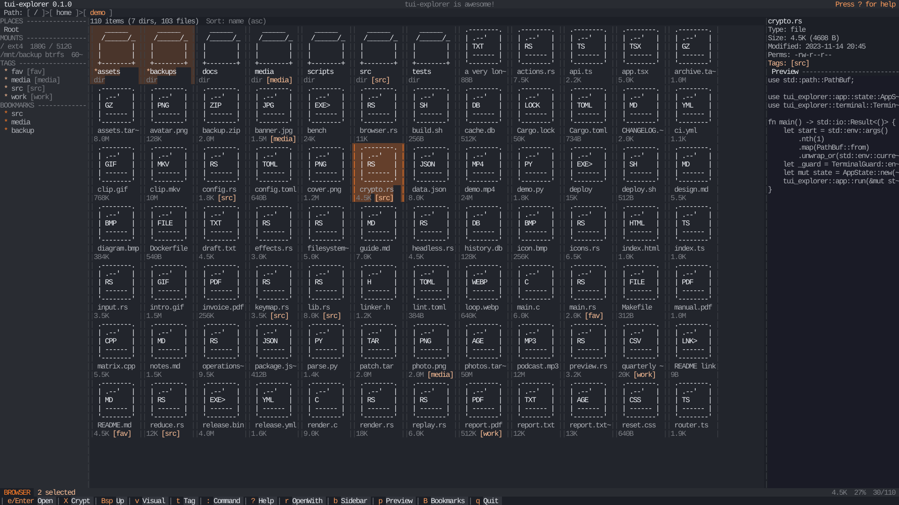
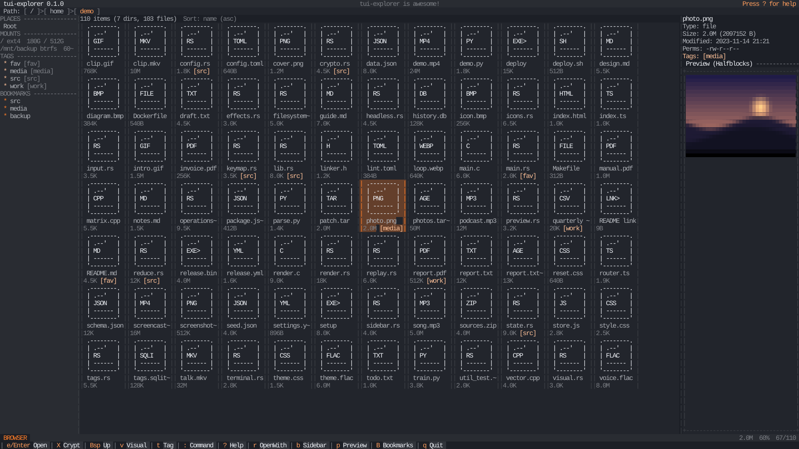
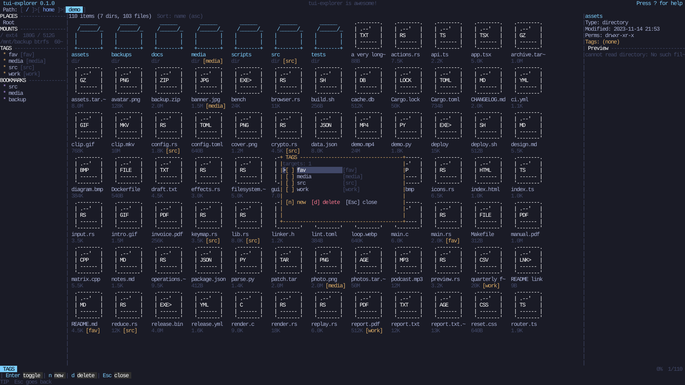
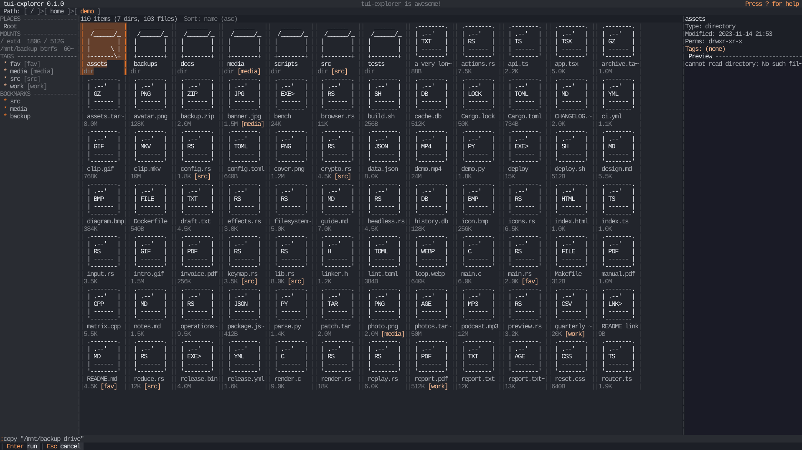
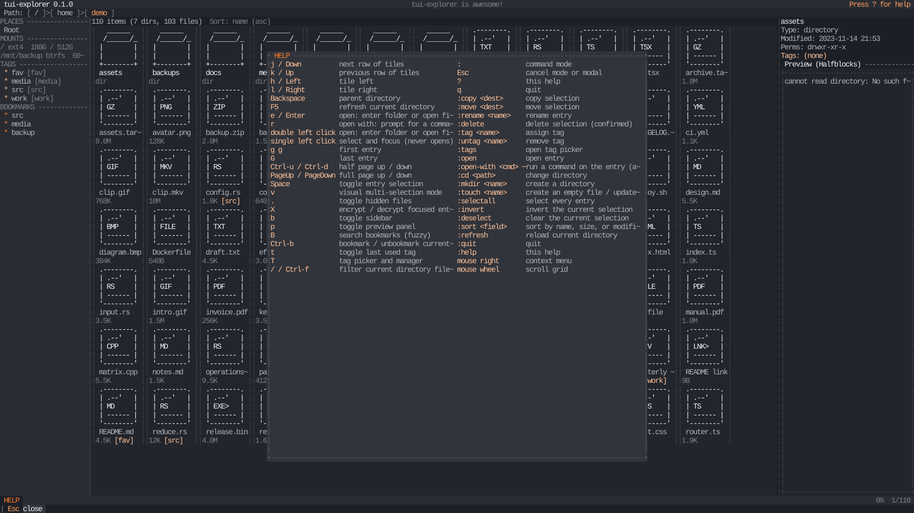
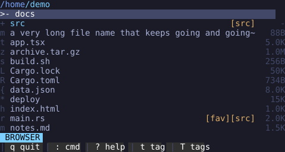

# tui-explorer

A fast, open-source terminal file explorer for Linux with mouse support for GUI-like navigation and full Vim-style keyboard controls. Browse, open, select, move, rename, copy, delete, encrypt, tag, and manage files without leaving the terminal.



## What it is

tui-explorer turns your terminal into a file manager that feels like a small desktop application. You can drive it entirely with the keyboard using Vim-style motions, or point and click with the mouse: click to select, double-click to open, right-click for a context menu, scroll with the wheel, and click the breadcrumb to jump to any parent directory. All icons are plain ASCII art drawn by the application's own icon engine, so it works in any terminal without Nerd Fonts, emoji support, or desktop icon themes.

Named tags (such as `[src]` or `[fav]`) can be attached to any file or directory and are stored in a local SQLite database, so they survive restarts. Files and folders can be encrypted and decrypted in place with the `age` crate's passphrase API, and image files render a live preview in the details panel on terminals that support Kitty, Sixel, or iTerm2 graphics (with a half-block fallback everywhere else).

## Features

- Thunar-style layout: places/mounts/tags/bookmarks sidebar, clickable breadcrumb, responsive ASCII-art icon grid, metadata/preview panel, status and command bars
- File and folder encryption with the `age` crate's passphrase API (`X`): files become `name.ext.age`, folders are tar-archived to `name.tar.age`; masked password dialog, atomic temp-file output, no source deletion, no silent overwrites, safe archive extraction (no `..` or absolute paths, symlinks never followed)
- Image previews in the panel (PNG, JPEG, GIF first frame, WebP, BMP) via `ratatui-image` with Kitty/Sixel/iTerm2 protocol detection and a half-block fallback; decode happens off the render loop
- Text and directory previews in the same panel, cached per focused entry and invalidated on mtime/size changes
- Directory browsing with breadcrumb, metadata columns, and symlink, executable, hidden, socket, pipe, and device distinctions
- Full Vim-style keyboard control plus complete mouse navigation; no operation requires a mouse
- Multi-selection with visual mode
- Colon commands for copy, move, rename, delete, tag, and navigation
- Original ASCII icon engine with compact, small, and large icon variants
- Persistent named tags backed by SQLite, with a tag picker for creating, assigning, and deleting tags
- Safe deletions: explicit confirmation, a second confirmation for recursive directory deletes, and conflict choices (cancel, skip, replace) for copy and move
- Background workers for long operations, with live progress in the status bar
- Responsive layout that adapts from ultrawide down to tiny terminals
- Correct handling of non-UTF-8 Linux filenames
- Deterministic, automatically generated screenshots and snapshot tests

## Screenshots

All raster screenshots are real renders of the application UI at exactly 1920x1080, generated from repository code (see [Regenerating screenshots](#regenerating-screenshots)).

Image preview in the details panel (half-block protocol rendering):



Tag picker and manager (`T`):



Command mode (`:`):



Help overlay (`?`):



Compact layout on a small terminal (SVG, 60x16 cells):



## Controls

| Key | Action |
| --- | --- |
| `j` / Down | move selection one grid row down |
| `k` / Up | move selection one grid row up |
| `h` / Left | move one tile left |
| `l` / Right | move one tile right |
| Backspace | open parent directory |
| `F5` | refresh the current directory |
| `e` / Enter | enter directory, or prompt for a command to open a file (the only keyboard open actions) |
| `r` | open with: prompt for a command to run on the focused entry |
| `X` | encrypt / decrypt the focused entry (masked password dialog) |
| `b` | toggle the sidebar |
| `p` | toggle the preview panel |
| `B` | open the fuzzy bookmark navigator |
| `Ctrl-b` | bookmark / unbookmark the current directory |
| `g g` | first entry |
| `G` | last entry |
| `Ctrl-u` / `Ctrl-d` | half page up / down |
| PageUp / PageDown | full page up / down |
| Space | toggle entry in selection |
| `v` | enter or leave visual multi-selection mode |
| `.` | toggle hidden files |
| `t` | toggle the default or last-used tag |
| `T` | open the tag picker and manager |
| `:` | enter command mode |
| `/` / `Ctrl-f` | quick filter: opens `:filter ` prompt for the current directory |
| Esc | cancel the current mode, modal, or command; clear an active filename filter |
| `?` | open the help overlay |
| `q` | quit (when no modal or command is active) |

Mouse controls:

- Left click: select a tile, activate a legend action, navigate the breadcrumb or jump to a sidebar place/mount/bookmark (a single click never opens anything)
- Double left click on the same entry: enter a directory, or prompt for a command to open a file
- Right click: context menu for the focused entry
- Mouse wheel: scroll the list
- Click a tag badge in the details panel: open the tag picker
- Click outside a modal: dismiss it (only when safe, destructive confirmations always cancel)

## Encryption

Press `X` on any entry. Regular files and folders are encrypted with the maintained `age` crate's passphrase API; a recognized encrypted output (`*.age`, `*.tar.age`) is decrypted instead. The password dialog masks input, requires confirmation for encryption, never logs or persists secrets, and `Esc` cancels without touching the filesystem.

- File `report.txt` encrypts to `report.txt.age`
- Folder `photos` is serialized to a portable tar stream (relative paths, empty directories preserved, symlinks stored but never followed) and encrypted to `photos.tar.age`
- Output is written to a temporary file, finalized, flushed, then atomically renamed; existing destinations are never overwritten and sources are never deleted automatically
- Decryption rejects archive entries with absolute paths or `..` components so malicious archives cannot escape the destination

## Configuration

- `TUI_EXPLORER_DOUBLE_CLICK_MS`: double-click threshold in milliseconds (default 500)
- `TUI_EXPLORER_IMAGE_PROTOCOL`: choose the image preview protocol (`halfblocks`, `kitty`, `sixel`, or `iterm2`). The stable cell-based `halfblocks` renderer is always the default; native Kitty/Sixel/iTerm2 graphics are explicit opt-ins because incorrect terminal geometry can overdraw a TUI.
- Bookmarks are stored in `$XDG_DATA_HOME/tui-explorer/bookmarks.txt`, tags in `tags.sqlite3` alongside it

## Command mode

Press `:` and type a command. Paths with spaces work when quoted, for example `:copy "/mnt/backup drive"`. Commands apply to all selected entries, or to the focused entry when nothing is selected.

| Command | Action |
| --- | --- |
| `:copy <destination>` (`:cp`) | copy targets to a directory |
| `:move <destination>` (`:mv`) | move targets to a directory |
| `:rename <new-name>` | rename the focused entry |
| `:delete` (`:rm`) | delete targets (always confirmed) |
| `:mkdir <name>` | create a directory in the current directory (parents created as needed) |
| `:touch <name>` | create an empty file, or update its modified time if it already exists |
| `:selectall` (`:select-all`) | select every entry in the current listing |
| `:invert` (`:invertselection`) | invert the current selection |
| `:deselect` (`:clearselection`) | clear the current selection |
| `:filter <text>` (`:search`) | show only matching names in the current directory |
| `:clearfilter` (`:clear-search`) | restore all names in the current directory |
| `:sort name|size|modified` | sort entries by name, size, or modification time; append `-desc` for descending order |
| `:refresh` (`:reload`) | reload the current directory |
| `:tag <name>` | assign a tag (created if missing) |
| `:untag <name>` | remove a tag |
| `:tags` | open the tag picker |
| `:open` | open the focused entry (directories enter, files prompt for a command) |
| `:open-with <command> [args...]` (`:ow`) | run `<command> [args...] <entry>` directly, no prompt |
| `:cd <path>` | change directory (`~` and relative paths work) |
| `:quit` (`:q`) | quit |
| `:help` | open the help overlay |

Command input is parsed by the application itself. It is never passed to a shell, and files are always opened by spawning programs directly with argument arrays.

### Open with

Press `r` on a focused entry to open a small prompt asking which command to run against it, for example typing `mupdf` to run `mupdf <path>` on a focused PDF, or `mupdf -r 150` to pass flags. The command is split the same quote-aware way as the rest of command mode, so `"my viewer" --flag` works.

The prompt is now the only way a file is opened: `e`/`Enter`, double-click, and `:open` all route into it, and nothing is remembered between prompts. `:open-with <command> [args...]` (alias `:ow`) skips the prompt because the command is already supplied on the line.

### Bookmarks

`Ctrl-b` bookmarks or unbookmarks the current directory (persisted in `bookmarks.txt`, one absolute path per line, unchanged format). `B` opens a fuzzy bookmark navigator: type to filter the bookmark list live (case-insensitive subsequence matching, basename matches ranked first), Up/Down or Ctrl-n/Ctrl-p to move the selection, Enter to navigate to the selected bookmark, Esc to close. The navigator opens even with no bookmarks and explains how to add one.

## Icons

Icons are built from ordinary ASCII characters by a first-party icon engine. No patched font is required. Each file category has a one-cell compact icon for narrow terminals, a small icon for lists, and larger ASCII art for the details panel.

| Icon | Category |
| --- | --- |
| `dir` | folder |
| `opn` | focused folder |
| `.dr` | hidden folder |
| `lnk` | symlink |
| `exe` | executable or binary |
| `rs` `ts` `js` `c` `c++` `py` `sh` | source files by language |
| `htm` `css` `jsn` `tml` `yml` `md` | web, data, and text formats |
| `img` `aud` `vid` | media files |
| `zip` `pdf` `db` | archives, documents, databases |
| `git` `cgo` `clk` `pkg` `lck` `mk` `dkr` `cfg` | git, Cargo, Node, make, container, and config files |
| `?` | unknown |

Resolution is deterministic: special filesystem type, special directory name, exact filename, compound extension, standard extension, executable status, then a generic fallback.

## Tags

Tags are named labels stored in a many-to-many SQLite database:

```
$XDG_DATA_HOME/tui-explorer/tags.sqlite3
```

If `XDG_DATA_HOME` is unset or invalid, the fallback is `$HOME/.local/share/tui-explorer/tags.sqlite3`. Mutable data is never written to `/usr`.

- `t` toggles the last-used tag on the selection
- `T` opens the picker: `n` creates a tag, Enter assigns or unassigns, `d` deletes a tag definition
- List rows show compact badges like `[fav]`; the details panel shows the full list
- Badges are text, so tags stay identifiable without color
- Unix paths are stored as raw bytes, so non-UTF-8 names round-trip exactly
- When you rename or move an entry inside tui-explorer, its tags follow automatically
- Moves done outside the application (for example with `mv`) cannot always be followed; the old path keeps its tags until you re-tag the new one

## Installation

Build from source with Cargo. You need a Rust toolchain (1.87 or newer, matching `rust-version` in `Cargo.toml`) and a C compiler for the bundled SQLite build.

Gentoo:

```
sudo emerge --ask dev-lang/rust dev-vcs/git
```

Arch Linux:

```
sudo pacman -S rust git
```

Debian or Ubuntu:

```
sudo apt install cargo rustc git build-essential
```

Any other distribution: install the equivalent Rust toolchain, Git, and a C compiler using its package manager.

Then:

```
git clone https://github.com/0bifthenelse/tui-explorer.git
cd tui-explorer
cargo build --release
./target/release/tui-explorer
```

Optional: install the binary into your user path, for example `cargo install --path .` which places it under `~/.cargo/bin`.

Or run the bundled installer from the repository root: `./install.sh`. It builds the release binary and installs it to `$HOME/.local/bin` for a regular user, or to `/usr/local/bin` when run as root (`sudo ./install.sh`). Pass `--prefix DIR` to install somewhere else. Re-running `install.sh` at any time overwrites the existing install seamlessly, with no prompt. Make sure the chosen `bin` directory is on your `PATH`; `install.sh` prints a warning with the exact `export` line if it is not.

## Running from source

```
cargo run --release
cargo run --release -- /some/start/directory
tui-explorer --help
tui-explorer --version
```

A positional argument selects the startup directory; without one the current working directory is used.

## Configuration and data locations

- Tags database: `$XDG_DATA_HOME/tui-explorer/tags.sqlite3`
- Configuration (reserved for future options): `$XDG_CONFIG_HOME/tui-explorer/config.toml`
- Disposable cache and logs: `$XDG_CACHE_HOME/tui-explorer/`

Opening files:

- Files always open through the command prompt: `e`/`Enter`, double-click, and `:open` ask which command to run; directories always open internally
- No environment variable or `xdg-open` fallback exists
- The interface suspends and restores the terminal around the child process and forces a full repaint afterwards

## Safety and deletion behavior

Deletion is permanent. `:delete` always opens a confirmation modal that names the target, and deleting directories requires a second, deliberate confirmation for the recursive step. Copy and move never overwrite silently: existing destinations open a conflict modal with cancel, skip, and replace choices. Copying or moving a directory into itself is rejected, as is any operation where source and destination are the same path. When a multi-entry operation partially fails, the status bar reports exactly how many entries completed, were skipped, and failed.

The terminal is protected by a lifecycle guard: raw mode, mouse capture, and the alternate screen are restored on exit, on error, and on panic.

## Non-UTF-8 paths

Linux filenames are bytes, not text. tui-explorer keeps paths as `PathBuf` and names as `OsString` internally and only converts to a display string (with the standard `�` replacement marker) at render time. Tag records store the raw bytes, so tagging works on any filename. Displayed text is never used as a filesystem identifier.

## Architecture

Single Cargo package with a library and three binaries (`tui-explorer`, the `screenshots` generator, and the `visual` dump harness):

- `app`: application state, modes, the reducer, and side-effect boundaries
- `ui`: layout tiers, rendering, and the hit-test model used by the mouse
- `input`: key mapping, click detection, and the command parser
- `browser`: directory state, sorting, filtering, selection, navigation
- `filesystem`: the `FileSystem` and `MutationBackend` traits plus the real Linux backend
- `operations`: copy, move, rename, delete jobs, validation, and conflict handling
- `crypto`: `age` passphrase encryption/decryption jobs with atomic output
- `preview`: text, directory, and image preview loading on worker threads
- `sidebar`: places, mounts, tags, and bookmarks model
- `icons`: the ASCII icon registry and resolver
- `tags`: the SQLite repository, schema, and migrations
- `config`: XDG path resolution
- `terminal`: lifecycle guard, panic hook, and suspend/resume for editors
- `testing`: in-memory filesystem, recording mutation service, deterministic builders, event replay, and the SVG converter

Domain state is independent of the terminal widgets, so behavior is tested without a terminal and without touching the real filesystem.

## Testing

```
cargo test --workspace
cargo clippy --workspace --all-targets --all-features -- -D warnings
cargo fmt --all --check
```

All automated tests run against a synthetic in-memory filesystem, a recording mutation service that performs no host I/O, and in-memory SQLite. No test creates, copies, renames, moves, or deletes a real file.

Visual snapshots live in `tests/snapshots/`. To review or update them deliberately:

```
UPDATE_SNAPSHOTS=1 cargo test --test visual
git diff tests/snapshots
```

## Headless visual verification

The real binary is tested end-to-end without a display server: `tests/headless.rs` runs it in a pseudo-terminal at 160x48, 120x36, 90x28 and 70x22, sends keystrokes, and replays the escape stream through a `vt100` parser to assert the rendered screen. `cargo run --bin visual` renders deterministic text and SVG frames of key scenarios into `docs/screenshots/visual/`.

## Regenerating screenshots

The README screenshots are built from synthetic demo data and rendered through the deterministic test backend — no display server, no real user files:

```
cargo run --bin screenshots
git diff docs/screenshots
```

This writes two kinds of artifacts:

- Compact SVG frames (`docs/screenshots/*.svg`) used by the visual-test workflow.
- Native 1920x1080 PNG rasters (`docs/screenshots/png/*.png`) used by this README. The UI is rendered on a 240x60 cell grid with an 8x18 pixel cell (exactly 1920x1080), converted to SVG with per-glyph positioning, and rasterized with `rsvg-convert` (from the `librsvg` package; on Gentoo: `sudo emerge --ask x11-libs/librsvg`). Every PNG header is validated after rasterization and the generator exits nonzero if a file is missing or the dimensions are not exactly 1920x1080, so a broken pipeline can never silently produce wrong images.

## Packaging notes

- Default build uses bundled SQLite (`bundled-sqlite` feature) for standalone binaries
- Distribution packages can link the system SQLite instead:

```
cargo build --release --no-default-features --features system-sqlite
```

- No root privileges, systemd integration, or desktop environment is required

## Manual verification required

Automated tests never exercise the real mutation backend by design. The following behaviors are implemented but must be verified manually against real files before a production release:

- Real copy, move, rename, and delete operations, including recursive directories and cross-device moves
- Real symlink copying
- Opening files through the command prompt on a live terminal
- Tag database creation, permissions, and persistence across restarts on a real home directory
- Kitty/Sixel/iTerm2 pixel output on a graphics terminal (headless tests exercise the half-block fallback only)

## Current limitations

- Linux only
- One directory pane; no tabs or dual-pane mode
- Search is currently limited to filtering names in the open directory; recursive content search is not included
- Display width of non-ASCII characters is approximated by character count
- External moves of tagged files are not followed automatically

## Contributing

Issues and pull requests are welcome at the [GitHub repository](https://github.com/0bifthenelse/tui-explorer). Keep changes focused, match the existing module boundaries, run the full test suite, and keep new filesystem behavior behind the `FileSystem` and `MutationBackend` traits so tests stay non-destructive.

## License

[MIT](LICENSE)
