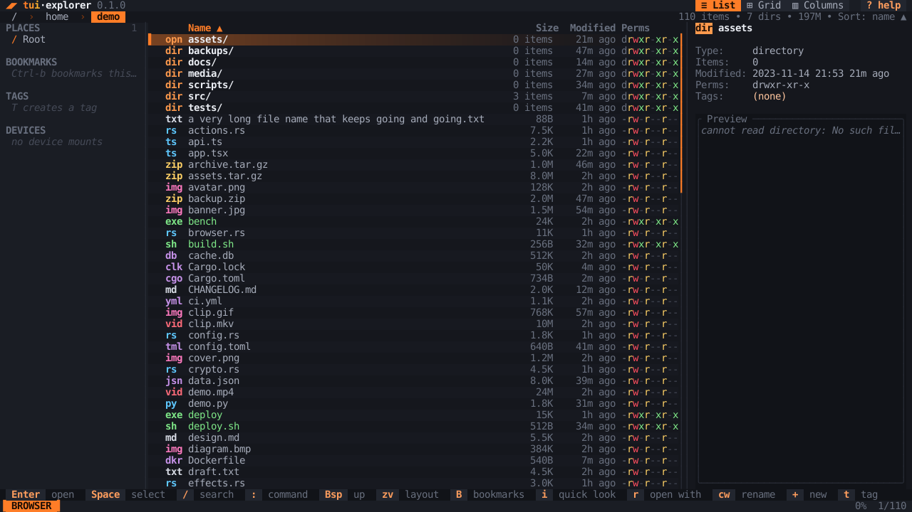
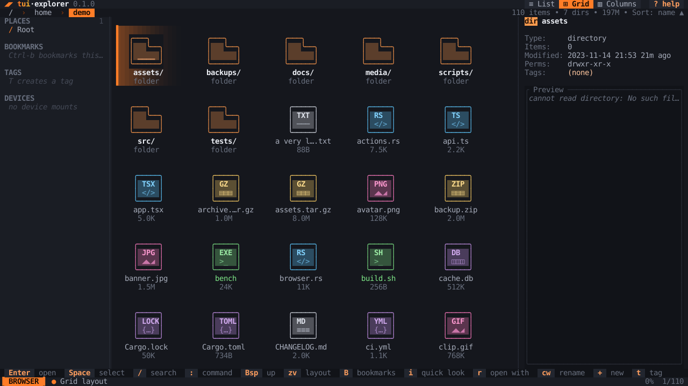
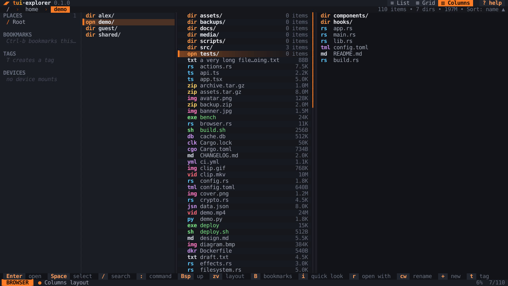
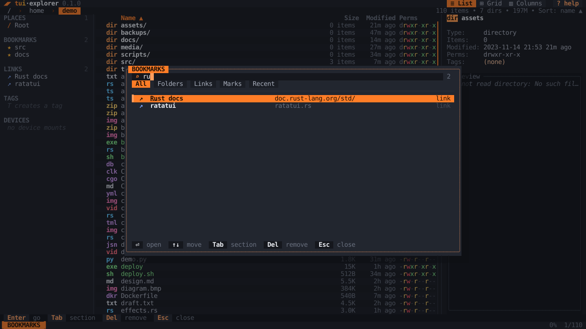
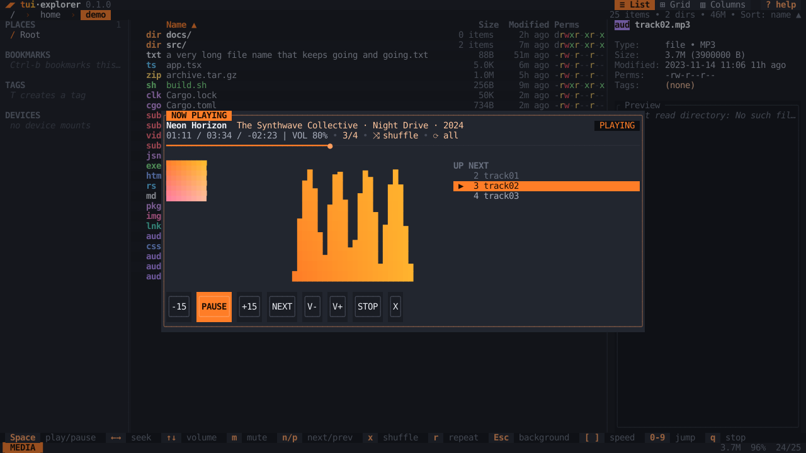
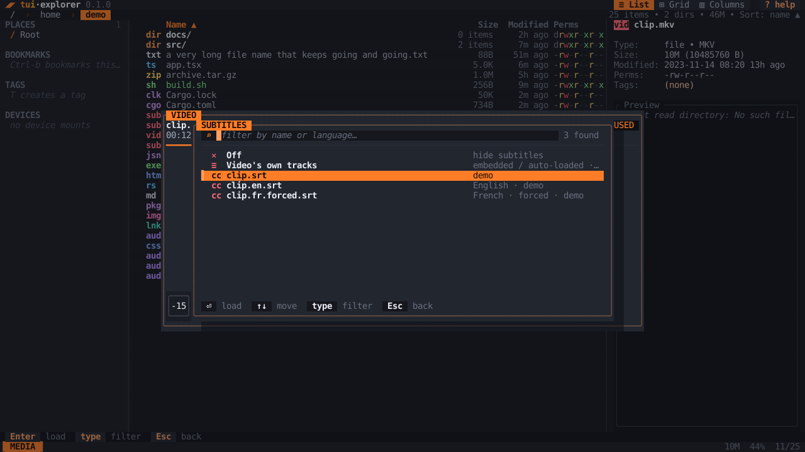
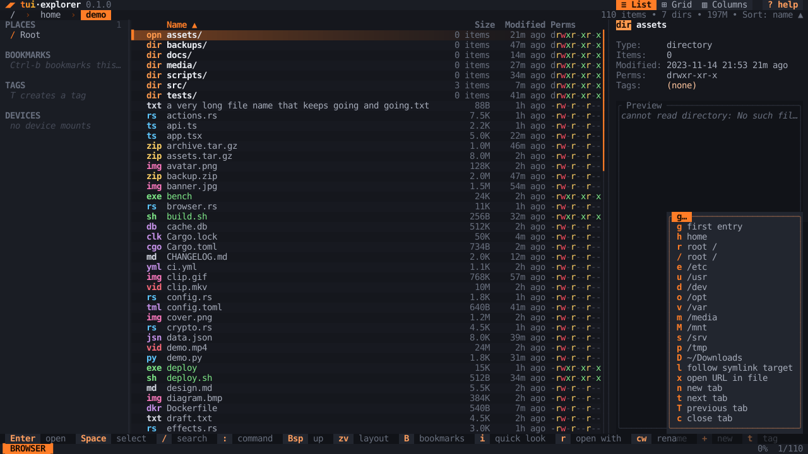
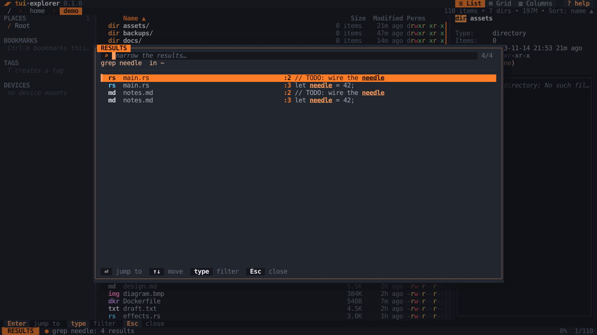
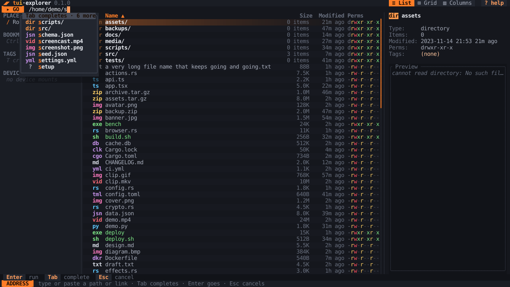

# tui-explorer

A fast, good-looking terminal file explorer for Linux. Ranger-style keyboard power, desktop-style mouse support, three live layouts, a built-in music and video player with subtitles, web links, tabs and undo, all in a dark graphite UI with a signal-orange accent and smooth, animated feedback.

## What it is

tui-explorer turns your terminal into a focused file manager that is pleasant to use with either hand on the keyboard or the mouse. Rows glide under an orange cursor rail, hovered entries tint toward the accent, selected entries fill solid `#ff7d27`, modals ease in over a soft scrim, and folder listings cascade in. With reduced motion (`:set animations off`, `za`, or `TUI_EXPLORER_REDUCED_MOTION=1`) everything snaps instantly.

Everything Ranger users expect is here: chords (`gg`, `yy`, `dd`, `pp`, `cw`, `gh`), counts (`5j`), marks, tabs, history, incremental search, `:find`, `:grep`, `:bulkrename`, `:chmod`, `:shell` with `%f %s %d` macros, trash with undo, and a which-key popup that lists what can follow the key you just pressed.

## Features

- **Three layouts, switchable live**: List (default, with size, child count, relative time and colored permissions), Grid (large or compact tiles) and Miller Columns (parent, current, preview). Switch with `zl` / `zg` / `zc`, `zv` to cycle, `:view`, or by clicking the header switcher. The layout is remembered.
- **Ranger-grade keyboard**: chords, counts, marks (`m<key>`, `'<key>`), tabs (`gn`, `gt`, `gc`, `uq`, Alt-1…9), history (`H` / `L`, `''`), go-to chords (`gh`, `gr`, `ge`, `gD`, …), sort chords (`os`, `om`, `or`, …), inline rename (`cw`, `A`, `I`, `a`), create (`+`, a trailing `/` makes a folder, nested paths allowed), copy, cut and paste (`yy`, `dd`, `pp`, `po`, `pl` for symlinks), trash (`dT`, Delete) and permanent delete (`dD`), undo (`uu`), yank path, folder, name or stem to the system clipboard (`yp`, `yd`, `yn`, `yN`; OSC 52 plus wl-copy, xclip or xsel), and a which-key popup.
- **Search three ways**: `/` highlights matches and jumps between them (`n` / `N`); `f` jumps as you type and opens a unique match; `Ctrl-f` / `zf` filters the listing. `:find <glob>` and `:grep <text>` search recursively on a worker thread and open a filterable results list.
- **Command line with autocomplete**: a live suggestion dropdown with descriptions, Tab completion of command names and paths, and persisted Up/Down history.
- **Address bar** (`Ctrl-L`, or click the path bar): edit the location in place with path completion. It accepts `~`, relative paths, `..` and `file://` URIs. A file path opens its folder with the file focused, and an `http(s)` link opens in the browser. Pasting a path or link into the browser opens the address bar pre-filled (bracketed paste).
- **Bookmarks hub** (`B`): folders, web links, marks and frecency-ranked recent folders behind one fuzzy search, with section tabs (Tab cycles) and Delete to remove. Web links live in the sidebar's LINKS section too.
- **URLs everywhere**: `:bookmark-url <url> [title]` saves links. Enter on a `.url` or `.webloc` shortcut opens its link. `gx` opens the URLs found in the focused file (a picker appears when there are several). URLs in text previews are underlined. Streamable links play in the built-in player when mpv is installed.
- **Open with, remembered per extension**: the first Enter on an unknown file type asks which program to use. Suggestion chips list what is installed (zathura, evince, imv, feh, nvim, libreoffice, …) and the choice is remembered for that extension, compound ones like `.tar.gz` included. `r` always asks again. GUI programs detach, terminal programs take over the screen until they exit. Text, code and images open in **Quick Look** (`i`), a scrollable full-screen viewer with line numbers.
- **Music player**: queue built from the folder or the selection, auto-advance, shuffle (`x`), repeat off, all or one (`r`), previous and next (`p` / `n`), speed (`[` `]`), jump to a percentage (`0`–`9`), volume up to 130 % that is remembered between sessions, mute (`m`), title, artist and album tags with embedded cover art, a smooth gradient spectrum, and a clickable "Up next" queue. Press Esc and the music keeps playing in a **status-bar mini player** with its own play, previous and next buttons; `M` brings the full player back.
- **Video player** (mpv): plays inside the player window on Kitty or sixel terminals, in mpv's own window when a display is available (`f` toggles real fullscreen), or as truecolor text on any terminal (`:set video kitty|sixel|window|tct|auto`). **Subtitles**: `c` opens a picker that finds `.srt`, `.ass`, `.ssa`, `.vtt` and `.sub` files next to the video, in `Subs/` folders (including `Subs/<video name>/`), in the parent folder and in `~/Downloads`, ranked by name match and language. Type to filter, Enter to load. `j` cycles tracks, `v` toggles subtitles, `z` / `Z` shift the delay, `a` cycles audio tracks. Loaded subtitles survive fullscreen restarts.
- **Shell integration**: `!` / `s` runs a shell line with `%f` (focused), `%s` (selection) and `%d` (folder) macros, shell-quoted. `S` opens an interactive shell in the current folder, `E` opens `$EDITOR`, and `:bulkrename` edits the selection's names in your editor and shows a confirmation before renaming (swaps and cycles are handled safely).
- **Safe file operations**: freedesktop trash with undo, conflict dialogs (cancel, skip, replace, keep both), pasting into the same folder makes "name (2)" copies, nested creation, `:chmod` with octal or symbolic modes, `:symlink`, folder sizes (`du`).
- **Encryption** with the `age` crate (`X`), **tags** backed by SQLite (`t`, `T`), image previews through Kitty, sixel or half-blocks, and mouse support throughout: click, double-click, right-click menus, marquee selection, drag-and-drop moves, wheel scrolling, clickable sort headers, tabs, breadcrumbs and sidebar.
- **Remembers you**: layout, sort, hidden files, panels, animations, icon style, video output, volume, associations, marks, recent folders and command history persist in `session.json`.
- Works without Nerd Fonts (`:set icons nerd` switches to Nerd glyphs), has an ASCII mode (`:set charset ascii`, `TUI_EXPLORER_ASCII=1`), maps colors to 256-color terminals automatically, measures CJK and emoji widths correctly, and handles non-UTF-8 file names.

## Screenshots

Layouts: List, Grid and Miller Columns (`zl`, `zg`, `zc`):







Bookmarks hub (`B`) with folders, web links, marks and recent folders:



Music player with tags, cover art, spectrum and queue:



Subtitle picker (`c` in the video player):



Which-key after pressing `g`, and `:grep` results:





Address bar with path completion (`Ctrl-L`):



## Keys

Press `?` for the complete, searchable list. The essentials:

| Keys | Action |
| --- | --- |
| `j` `k` / arrows, `5j` | move (counts work) |
| `h` / `l` | parent folder / open (in Grid: move between tiles) |
| Enter, `e`, double-click | open: folders enter, media plays, text and images open in Quick Look, other files use the remembered program |
| `gg` / `G` / `J` `K` | first / last / half page |
| `gh` `gr` `ge` `gu` `gD` … | go to home, `/`, `/etc`, `/usr`, `~/Downloads` … |
| `H` / `L` / `''` | history back / forward / previous folder |
| `gn` `gt` `gT` `gc` `uq`, Alt-1…9 | tabs: new, next, previous, close, restore, jump |
| Space / `v` / `V` / Ctrl-A / `uv` | toggle and move / visual range / invert / all / clear |
| `yy` `dd` `pp` `po` `pl` | copy, cut, paste, paste overwriting, paste as symlinks |
| `yp` `yd` `yn` `yN` | yank path, folder, name, name without extension |
| `cw` F2 `A` `I` `a` | rename (inline, in the row) |
| `+` | create (`name/` makes a folder, `a/b/c.txt` works) |
| `dT` Delete / `dD` | trash / delete forever (confirmed) |
| `uu` Ctrl-Z | undo the last rename, move, copy, trash or create |
| `/` `n` `N`, `f`, Ctrl-F | search, find-as-you-type, filter |
| `m<key>` / `'<key>` / `um<key>` | set / jump to / delete a mark |
| `B` / Ctrl-B | bookmarks hub / bookmark this folder |
| Ctrl-L | address bar |
| `gx` / `gl` | open URLs in the file / follow a symlink |
| `zl` `zg` `zc` `zv` | list, grid, columns, cycle |
| `zh` or `.`, `zp`, `zs` or `b`, `za` | hidden files, preview, sidebar, animations |
| `os` `om` `on` `ot` `oe` `or` | sort by size, modified, name, type, extension; reverse |
| `i` / `r` / `E` | quick look / open with… / edit in `$EDITOR` |
| `!` `s` / `S` | shell command / interactive shell here |
| `du` | folder sizes |
| `X` / `t` `T` | encrypt or decrypt / tags |
| `M` | show the player (from the mini player) |
| `:` `?` `q` | command line, help, quit |

Player keys:

| Keys | Action |
| --- | --- |
| Space / Enter | play / pause |
| ← → (`h` `l`), Shift-← → (`H` `L`) | seek 15 s / 60 s |
| `0`…`9` | jump to 0 %…90 % |
| ↑ ↓ `+` `-` / `m` | volume (up to 130 %, remembered) / mute |
| `n` / `p` | next / previous track |
| `x` / `r` | shuffle / repeat off, all, one |
| `[` `]` Backspace | slower / faster / normal speed |
| `c` / `j` / `v` / `z` `Z` | subtitle picker / next track / on-off / delay -/+ 0.1 s |
| `a` | next audio track |
| `f` | fullscreen video |
| Esc | audio: keep playing in the mini player; video: close |
| `q` / `s` | stop and close / restart from the beginning |

Mouse: click selects, double-click opens, right-click opens a context menu (bulk on selections), drag on the background draws a marquee, dragging entries onto a folder moves them (Ctrl copies), the wheel scrolls, and column headers, the layout switcher, tabs, breadcrumbs, the sidebar, legend keycaps, chips and mini-player buttons are all clickable.

### Supported audio formats

| Route | Formats |
| --- | --- |
| Native (Symphonia, no external player) | `wav`, `flac`, `ogg`, `oga`, `mp3`, `m4a` (AAC-LC and ALAC), `aif`, `aiff`, `aifc` |
| mpv fallback | `opus`, `wma` |

M4A files play natively for both AAC-LC and ALAC: the container's codec parameters are completed decoder-side when the demuxer leaves them unset. AIFF files are handled by a built-in parser supporting uncompressed integer PCM (`NONE`, `sowt`, `twos`) at 8, 16, 24, and 32 bits per sample plus 32-bit floats; other AIFF compressions report a typed error instead of failing silently. Every format in the native route is exercised by the deterministic fixture suite under `tests/fixtures/audio/`, which decodes, seeks within, and checks durations of real generated tones; the claims above reflect exactly what those tests cover.

## Command mode

Press `:` and type. A dropdown suggests commands with descriptions, Tab completes command names and paths, Up/Down walks the persisted history. Quote paths with spaces: `:copy "/mnt/backup drive"`. Commands act on the selection, or on the focused entry when nothing is selected. Command input is parsed by the application and never passed to a shell (except `:shell`, which is explicit).

| Command | Action |
| --- | --- |
| `:cd <path>` | change folder (`~`, relative, `file://`; a file path focuses the file; a web link opens it) |
| `:copy` / `:move <dest>` (`:cp` / `:mv`) | copy / move to a folder |
| `:rename <name>`, `:bulkrename` | rename one entry / rename the selection in `$EDITOR` |
| `:create <name>` (`:new`), `:mkdir`, `:touch` | create files and folders (`name/` = folder, nested paths) |
| `:delete` (`:rm`), `:trash`, `:undo` | delete (confirmed), move to trash, undo |
| `:chmod <mode>` | `755`, `+x`, `go-w`, … |
| `:symlink <name>` | create a symbolic link to the focused entry |
| `:search <text>`, `:filter <text>`, `:clearfilter` | highlight matches, filter the listing |
| `:find <glob>`, `:grep <text>` | recursive name / content search with a results list |
| `:sort name\|size\|modified\|type\|extension[-desc]` | sort |
| `:view list\|grid\|columns` | layout |
| `:set <key> <value>` | `animations`, `hidden`, `charset`, `icons`, `preview`, `sidebar`, `view`, `grid`, `sort`, `video`, `subs`, `volume` |
| `:shell <cmd>` | run a shell line; `%f` focused, `%s` selection, `%d` folder (shell-quoted) |
| `:du` | folder sizes |
| `:tab new\|close`, `:mark <key>` | tabs and marks |
| `:bookmark-url <url> [title]`, `:url <url>`, `:links` | web links |
| `:assoc [ext command]`, `:unassoc <ext>` | list, set or forget "open with" programs |
| `:open`, `:open-with <cmd> [args]` (`:ow`) | open / run a program directly |
| `:play`, `:pause`, `:next`, `:prev`, `:queue`, `:sub <path>` | player control |
| `:tag <name>`, `:untag <name>`, `:tags` | tags |
| `:selectall`, `:invert`, `:deselect`, `:refresh`, `:help`, `:quit` | misc |

## Encryption

Press `X` on any entry. Regular files and folders are encrypted with the maintained `age` crate's passphrase API; a recognized encrypted output (`*.age`, `*.tar.age`) is decrypted instead. The password dialog masks input, requires confirmation for encryption, never logs or persists secrets, and `Esc` cancels without touching the filesystem.

- File `report.txt` encrypts to `report.txt.age`
- Folder `photos` is serialized to a portable tar stream (relative paths, empty directories preserved, symlinks stored but never followed) and encrypted to `photos.tar.age`
- Output is written to a temporary file, finalized, flushed, then atomically renamed; existing destinations are never overwritten and sources are never deleted automatically
- Decryption rejects archive entries with absolute paths or `..` components so malicious archives cannot escape the destination

## Configuration

Preferences are saved automatically to `$XDG_DATA_HOME/tui-explorer/session.json` (`:set` changes them live). Environment variables:

- `TUI_EXPLORER_REDUCED_MOTION=1`: no animations
- `TUI_EXPLORER_ASCII=1`: ASCII-only glyphs
- `TUI_EXPLORER_IMAGE_PROTOCOL`: force `halfblocks`, `kitty`, `sixel` or `iterm2` for image previews (otherwise detected with a short, non-blocking terminal query)
- `TUI_EXPLORER_DOUBLE_CLICK_MS`: double-click threshold (default 500)
- `$EDITOR` / `$VISUAL`, `$SHELL`, `$BROWSER` are honored; `COLORTERM=truecolor` enables 24-bit color (otherwise the frame is mapped to 256 colors)

## Icons

Icons are built from ordinary ASCII characters by a first-party icon engine. No patched font is required. Each file category has a one-cell compact icon for narrow terminals, a small icon for lists, and larger ASCII art for the details panel.

| Icon | Category |
| --- | --- |
| `dir` | folder |
| `opn` | focused folder |
| `.dr` | hidden folder |
| `lnk` | symlink |
| `exe` | executable or binary |
| `rs` `ts` `js` `c` `c++` `py` `sh` | source files by language |
| `htm` `css` `jsn` `tml` `yml` `md` | web, data, and text formats |
| `img` `aud` `vid` | media files |
| `zip` `pdf` `db` | archives, documents, databases |
| `git` `cgo` `clk` `pkg` `lck` `mk` `dkr` `cfg` | git, Cargo, Node, make, container, and config files |
| `?` | unknown |

Resolution is deterministic: special filesystem type, special directory name, exact filename, compound extension, standard extension, executable status, then a generic fallback.

## Tags

Tags are named labels stored in a many-to-many SQLite database:

```
$XDG_DATA_HOME/tui-explorer/tags.sqlite3
```

If `XDG_DATA_HOME` is unset or invalid, the fallback is `$HOME/.local/share/tui-explorer/tags.sqlite3`. Mutable data is never written to `/usr`.

- `t` toggles the last-used tag on the selection
- `T` opens the picker: `n` creates a tag, Enter assigns or unassigns, `d` deletes a tag definition
- List rows show compact badges like `[fav]`; the details panel shows the full list
- Badges are text, so tags stay identifiable without color
- Unix paths are stored as raw bytes, so non-UTF-8 names round-trip exactly
- When you rename or move an entry inside tui-explorer, its tags follow automatically
- Moves done outside the application (for example with `mv`) cannot always be followed; the old path keeps its tags until you re-tag the new one

## Installation

Build from source with Cargo. You need a Rust toolchain (1.87 or newer, matching `rust-version` in `Cargo.toml`) and a C compiler for the bundled SQLite build.

Gentoo:

```
sudo emerge --ask dev-lang/rust dev-vcs/git
```

Arch Linux:

```
sudo pacman -S rust git
```

Debian or Ubuntu:

```
sudo apt install cargo rustc git build-essential
```

Any other distribution: install the equivalent Rust toolchain, Git, and a C compiler using its package manager.

Then:

```
git clone https://github.com/0bifthenelse/tui-explorer.git
cd tui-explorer
cargo build --release
./target/release/tui-explorer
```

Optional: install the binary into your user path, for example `cargo install --path .` which places it under `~/.cargo/bin`.

Or run the bundled installer from the repository root: `./install.sh`. It builds the release binary and installs it to `$HOME/.local/bin` for a regular user, or to `/usr/local/bin` when run as root (`sudo ./install.sh`). Pass `--prefix DIR` to install somewhere else. Re-running `install.sh` at any time overwrites the existing install seamlessly, with no prompt. Make sure the chosen `bin` directory is on your `PATH`; `install.sh` prints a warning with the exact `export` line if it is not.

## Running from source

```
cargo run --release
cargo run --release -- /some/start/directory
tui-explorer --help
tui-explorer --version
```

A positional argument selects the startup directory; without one the current working directory is used.

## Configuration and data locations

- Session (preferences, associations, marks, recent folders, command history): `$XDG_DATA_HOME/tui-explorer/session.json`
- Folder bookmarks: `bookmarks.txt`; web links: `links.tsv` (`title<TAB>url`); tags: `tags.sqlite3`, all in the same folder
- Trash: the freedesktop trash (`$XDG_DATA_HOME/Trash`), so files trashed here show up in your desktop's trash too
- Disposable cache and logs: `$XDG_CACHE_HOME/tui-explorer/`

## Safety and deletion behavior

Deletion is permanent. `:delete` always opens a confirmation modal that names the target, and deleting directories requires a second, deliberate confirmation for the recursive step. Copy and move never overwrite silently: existing destinations open a conflict modal with cancel, skip, and replace choices. Copying or moving a directory into itself is rejected, as is any operation where source and destination are the same path. When a multi-entry operation partially fails, the status bar reports exactly how many entries completed, were skipped, and failed.

The terminal is protected by a lifecycle guard: raw mode, mouse capture, and the alternate screen are restored on exit, on error, and on panic.

## Non-UTF-8 paths

Linux filenames are bytes, not text. tui-explorer keeps paths as `PathBuf` and names as `OsString` internally and only converts to a display string (with the standard `�` replacement marker) at render time. Tag records store the raw bytes, so tagging works on any filename. Displayed text is never used as a filesystem identifier.

## Architecture

Single Cargo package with a library and three binaries (`tui-explorer`, the `screenshots` generator, and the `visual` dump harness):

- `app`: application state, modes, the reducer and side-effect boundaries; `ranger` (chords, tabs, marks, clipboard, undo, prompts), `commands`, `cmdline` (suggestions, completion, history), `hub` (bookmarks hub), `links` (URLs), `open` (associations, quick look) and `media_ctl` (queue, mini player, subtitles, volume)
- `ui`: layout tiers and rendering (`list`, `grid`, `columns`, `chrome`, `side`, `preview`, `modals`, `overlays`, `media`), the implicit animation engine (`anim`), color math (`theme`), glyph sets, and the hit-test model used by the mouse
- `input`: the chord binding table (also the source of the help screen), key mapping, the line editor and the command parser
- `settings`: persisted preferences (`session.json`)
- `search`: recursive find, grep and folder sizes
- `urls`: URL scanning, shortcut files and the link store
- `system`: clipboard (OSC 52), detached launches, `$EDITOR` and shell round trips
- `media`: audio decoding and spectrum, mpv control, subtitle discovery and track tags
- `browser`: directory state, sorting, filtering, selection, navigation
- `filesystem`: the `FileSystem` and `MutationBackend` traits plus the real Linux backend
- `operations`: copy, move, rename, delete jobs, validation, and conflict handling
- `crypto`: `age` passphrase encryption/decryption jobs with atomic output
- `preview`: text, directory, and image preview loading on worker threads
- `sidebar`: places, mounts, tags, and bookmarks model
- `icons`: the ASCII icon registry and resolver
- `tags`: the SQLite repository, schema, and migrations
- `config`: XDG path resolution
- `terminal`: lifecycle guard, panic hook, suspend/resume, bracketed paste, and the non-blocking graphics capability probe
- `testing`: in-memory filesystem, recording mutation service, deterministic builders, event replay, and the SVG converter

Domain state is independent of the terminal widgets, so behavior is tested without a terminal and without touching the real filesystem.

## Testing

```
cargo test --workspace
cargo clippy --workspace --all-targets --all-features -- -D warnings
cargo fmt --all --check
```

All automated tests run against a synthetic in-memory filesystem, a recording mutation service that performs no host I/O, and in-memory SQLite. No test creates, copies, renames, moves, or deletes a real file.

Visual snapshots live in `tests/snapshots/`. To review or update them deliberately:

```
UPDATE_SNAPSHOTS=1 cargo test --test visual
git diff tests/snapshots
```

## Headless visual verification

The real binary is tested end-to-end without a display server: `tests/headless.rs` runs it in a pseudo-terminal at 160x48, 120x36, 90x28 and 70x22, sends keystrokes, and replays the escape stream through a `vt100` parser to assert the rendered screen. `cargo run --bin visual` renders deterministic text and SVG frames of key scenarios into `docs/screenshots/visual/`.

## Regenerating screenshots

The README screenshots are built from synthetic demo data and rendered through the deterministic test backend. No display server or real user files are involved:

```
cargo run --bin screenshots
git diff docs/screenshots
```

This writes two kinds of artifacts:

- Compact SVG frames (`docs/screenshots/*.svg`) used by the visual-test workflow.
- Native 1920x1080 PNG rasters (`docs/screenshots/png/*.png`) used by this README. The UI is rendered on a 240x60 cell grid with an 8x18 pixel cell (exactly 1920x1080), converted to SVG with per-glyph positioning, and rasterized with `rsvg-convert` (from the `librsvg` package; on Gentoo: `sudo emerge --ask x11-libs/librsvg`). Every PNG header is validated after rasterization and the generator exits nonzero if a file is missing or the dimensions are not exactly 1920x1080, so a broken pipeline can never silently produce wrong images.

## Packaging notes

- Default build uses bundled SQLite (`bundled-sqlite` feature) for standalone binaries
- Audio playback needs ALSA headers at build time: Gentoo `media-libs/alsa-lib`, Arch `alsa-lib`, Debian/Ubuntu `libasound2-dev`
- Direct video playback additionally requires the `mpv` player at runtime: Gentoo `media-video/mpv`, Arch `mpv`, Debian/Ubuntu `mpv`
- Distribution packages can link the system SQLite instead:

```
cargo build --release --no-default-features --features system-sqlite
```

- No root privileges, systemd integration, or desktop environment is required

## Manual verification required

Automated tests never exercise the real mutation backend by design. The following behaviors are implemented but must be verified manually against real files before a production release:

- Real copy, move, rename, and delete operations, including recursive directories and cross-device moves
- Real symlink copying
- Opening files through the command prompt on a live terminal
- Tag database creation, permissions, and persistence across restarts on a real home directory
- Kitty/Sixel/iTerm2 pixel output on a graphics terminal (headless tests exercise the half-block fallback only)
- Live audio output through a real ALSA device and live mpv video playback on Kitty, sixel, window and text outputs (automated tests drive the player state machine deterministically; the real-time paths were exercised manually under tmux, Xvfb and an ALSA null sink)

## Current limitations

- Linux only
- Directory listings are read on the UI thread; extremely large folders can pause briefly
- File operations run one job at a time
- External moves of tagged files are not followed automatically
- Text-mode video (`tct`) gives mpv the whole terminal while playing; the controls return when paused

## Contributing

Issues and pull requests are welcome at the [GitHub repository](https://github.com/0bifthenelse/tui-explorer). Keep changes focused, match the existing module boundaries, run the full test suite, and keep new filesystem behavior behind the `FileSystem` and `MutationBackend` traits so tests stay non-destructive.

## License

[MIT](LICENSE)
